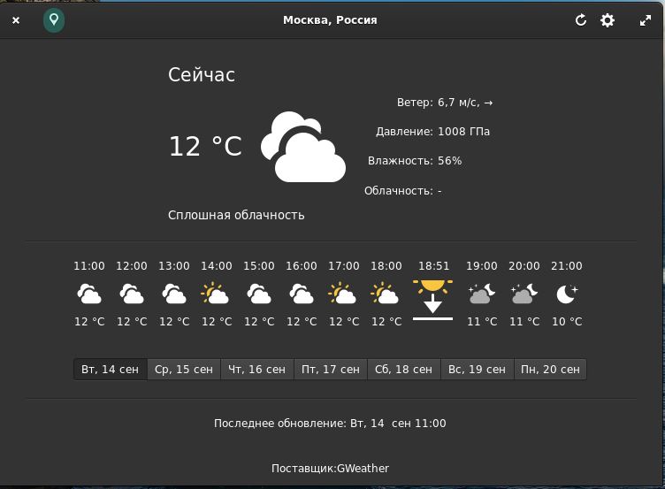
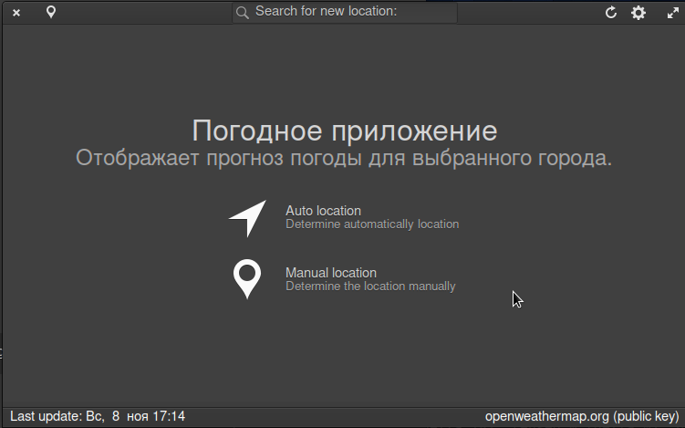
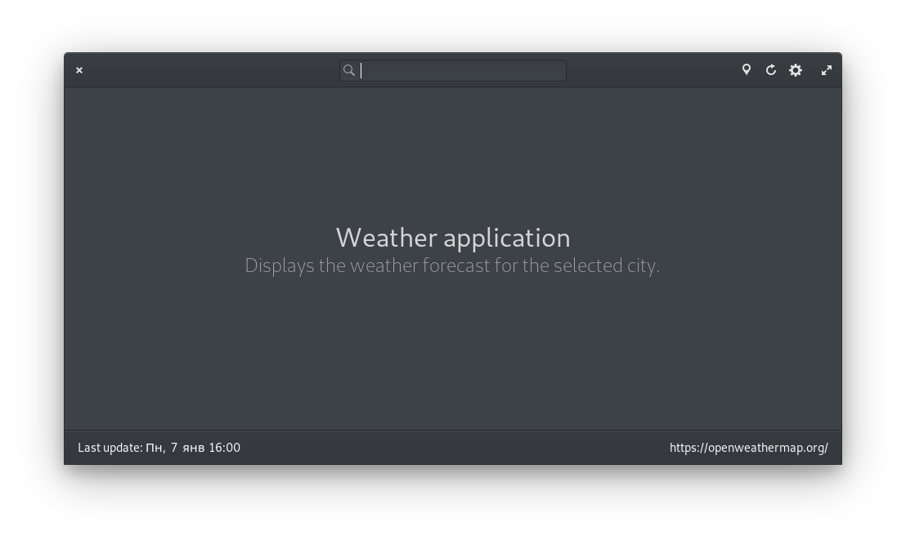

# Pantheon-meteo
Know the forecast of the next hours & days using OpenWeatherMap API (https://openweathermap.org/)

    

### Features:

* Current weather, with information about temperature, pressure, wind speed and direction, sunrise & sunset.
* Forecast for next 18 hours.
* Forecast for next five days.
* Choose your units (metric or imperial).
* Wingpanel indicator.

----

  

---

## Building and Installation

You'll need the following dependencies to build:

* libgtk-3-dev
* libsoup2.4-dev
* libgranite-dev
* libjson-glib-dev
* libgeocode-glib-dev
* libgeoclue-2-dev
* libgweather-3-dev
* meson
* valac

### How To Build

    meson build --prefix=/usr
    ninja -C build
    sudo ninja -C build install
