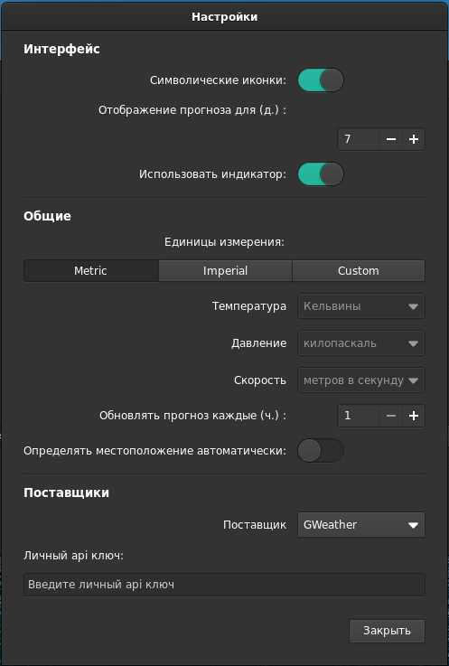

## METEO

### Know the forecast of the next hours & days.

Developed with Vala & Gtk, using OpenWeatherMap API (https://openweathermap.org/)

### Features:

- Current weather, with information about temperature, pressure, wind speed and direction, sunrise & sunset.
- Forecast for next 18 hours.
- Forecast for next five days.
- Choose your units (metric or imperial).
- Wungpanel indicator.

----

  

### Prefrences

---

### How To Install

### How To Build

Library Dependencies :

- libgtk-3-dev
- libsoup2.4-dev
- libgranite-dev
- libjson-glib-dev
- libgeocode-glib-dev
- libgweather-3-dev
- meson
- valac

Run `meson` to configure the build environment and then `ninja` to build

    meson build --prefix=/usr
    cd build
    ninja

To install, use `ninja install`

    sudo ninja install

I took the code base from https://gitlab.com/bitseater project. Changes:
- rewritten indicator
- added the ability to set the indicator optional (for gentoo)
- yet removed the card, perhaps temporarily
